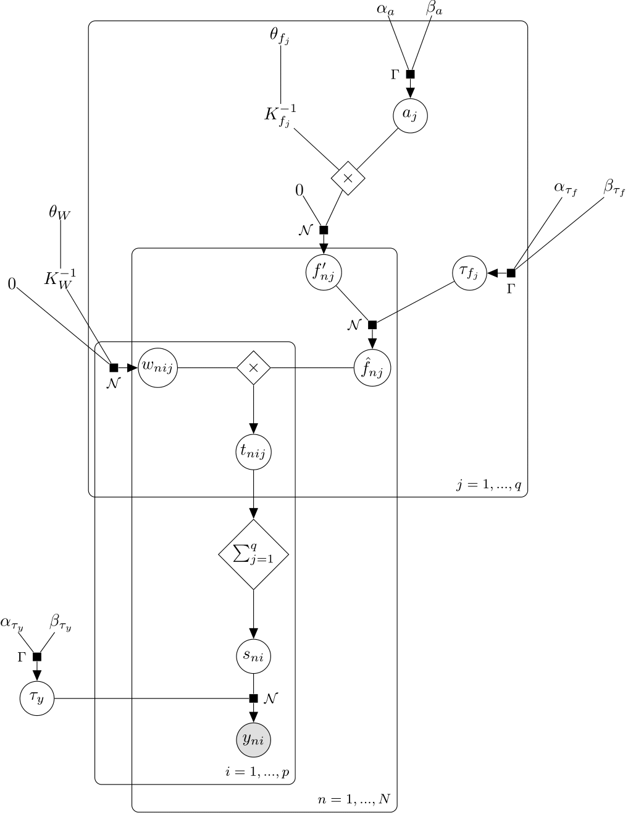

# GPRN Notebook
### Alexander Von Moll

A research notebook for exploring the usage of `bayespy` for implementing [Gaussian Process Regression Networks][GPRN paper].

## Tasks

- [x] Draw graph of all variables, parameters, and hyperparemeters for GPRN
  - 
- [ ] Implement GPRN
  - [ ] Build GPRN framework in `bayespy` for learning hyperparameters
    - [ ] Translate graph into code 
    - [ ] Implement update message for $a_j$ as described in [the paper][GPRN paper]
    - [ ] Implement update for $\theta_f$
    - [ ] Implement update for $\theta_W$
  - [ ] Implement MCMC sampling ([possibly using elliptical slice sampling](https://github.com/jobovy/bovy_mcmc/blob/master/bovy_mcmc/elliptical_slice.py))
  - [ ] Build a simple API
- [ ] Obtain data used in [the paper][GPRN paper]
- [ ] Test new implementation using data

[GPRN paper]:  http://arxiv.org/pdf/1110.4411
